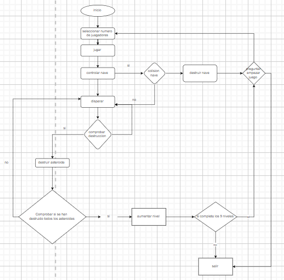

# Player's Manual
## How to Play:
## Starting the Game:

Upon starting the game, an initial interface will appear where you can select the number of players (1 or 2).
Control of the Ship: Use the arrow keys to move the ship in the desired direction.

### For player 1:

- Up: Up arrow key
- Down: Down arrow key
- Left: Left arrow key
- Right: Right arrow key

### For player 2:

- Up: "W" key
- Down: "S" key
- Left: "A" key
- Right: "D" key

**Firing:** Press the spacebar or "J" (player 1) / "Space" (player 2) to fire bullets from your ship.
**Asteroid Destruction**: Shoot at the asteroids that appear on the screen to destroy them and increase your score.
**End of Game**: The game ends when all levels have been completed.

# Number of Players and Keys:

## 1 Player:

**Movement:** Arrow keys (up, down, left, right)
**Fire:** "J" key

## 2 Players:

### Player 1:

**Movement:** Arrow keys (up, down, left, right)
**Fire:** "J" key

### Player 2:

**Movement:** "W", "S", "A", "D" keys
**Fire:** "Space" key

This manual provides basic instructions to start playing and the associated keys to control the ships and fire in the game. Enjoy!

## Class Diagram:
### Methods:
```plaintext
+---------------------------+
|      GameObject           |
+---------------------------+
| - image: pygame.Surface   |
| - position: tuple         |
| - rect: pygame.Rect       |
| + move()                  |
| + draw()                  |
+---------------------------+
             |
             v
+---------------------------+
|      Ship                 |
+---------------------------+
| - speed: dict             |
| - player_idx: int         |
| - cooling_time: int       |
| - explode_stop: int       |
| + explode()               |
| + move()                  |
| + draw()                  |
| + shot()                  |
+---------------------------+
                ^
                |
+---------------------------+
|      Bullet               |
+---------------------------+
| - speed: int              |
| - player_idx: int         |
| + move()                  |
| + draw()                  |
+---------------------------+
                ^
                |
+---------------------------+
|     Asteroid              |
+---------------------------+
| - speed: int              |
| - angle: int              |
| - angular_velocity: int   |
| - rotate_ticks: int       |
| + move()                  |
| + rotate()                |
| + draw()                  |
+---------------------------+

```
## flow diagram:




## Entity-Relationship Diagram:

```plaintext
+------------------+  1   +------------------+  N   +------------------+  N   +------------------+
|     Player       |----->|       Ship       |----->|       Bullet     |----->|    Asteroid      |
+------------------+      +------------------+      +------------------+      +------------------+
| ID               |      | ID               |      | ID               |      | ID               |
| Name             |      | Position         |      | Position         |      | Position         |
+------------------+      | Velocity         |      | Velocity         |      | Velocity         |
                          | State            |      | Trajectory       |      | Size             |
                          | Player_ID (FK)   |      +------------------+      | Trajectory       |
                           +------------------+            |                  +------------------+
                                  |  N                     |                        
                                  |                        |                        
                                  |                        |                        
                           +------------------+            |                        
                           |      Level       |------------+                        
                           +------------------+                                     
                           | ID               |                                     
                           | Number           |                                    
                           | Asteroid_qty     |                                     
                           | Asteroid_speed   |                                     
                           +------------------+                                     
                                                                                     
                                 
                                                                                     
```

Asteroid**

# Secuence Diagram:
```plaintext


Usuario                                                      Juego
   │                                                           │
   ├─── Inicio ----------------------------------------------->│
   │                                                           │
   │<── Mostrar Interfaz de Inicio ----------------------------│
   │                                                           │
   ├─── Seleccionar Número de Jugadores ---------------------->│
   │                                                           │
   │<── Jugar -------------------------------------------------│
   │                                                           │
   ├─── Controlar Nave(s) ------------------------------------>│
   │   │                                                       │
   │   ├─── Disparar ----------------------------------------->│
   │   │                                                       │
   │   │<─── Colisión con Asteroides --------------------------│
   │   │                                                       │
   │   │   ├─── Aumentar Puntuación -------------------------> │
   │   │   │                                                   │
   │   │   │   ├─── Comprobar si se han destruido todos los │  │
   │   │   │   │      asteroides -------------------------->│  │
   │   │   │   │                                               │
   │   │   │   │<── Sí --------------------------------------  │
   │   │   │   │                                               │
   │   │   │   ├─── Aumentar Nivel ------------------------->  │
   │   │   │   │                                               │
   │   │   │   ├─── ¿Todos los niveles completados? ---------> │
   │   │   │   │                                               │
   │   │   │   │<── Sí --------------------------------------  │
   │   │   │   │                                               │
   │   │   │   ├─── Mostrar Mensaje de Fin del Juego ------->  │
   │   │   │   │                                               │
   │   │   │   ├─── Mostrar Interfaz de Fin del Juego ------>  │
   │   │   │   │                                               │
   │   │   │   ├─── Reiniciar o Salir -----------------------> │
   │   │   │   │                                               │
   │   │   │   └─── Fin -------------------------------------> │
   │   │   │                                                   │
   │   │   └─── No ----------------------------------------->  │
   │   │                                                       │
   │   └─── <--------------------------------------------------│
   │                                                           │
   └─── <------------------------------------------------------│

```

Thank you for playing! I hope you enjoyed the experience.

-------------------------------------------------------------

# Manual del Jugador

## Cómo Jugar:

### **Inicio del Juego: **

Al iniciar el juego, se mostrará una interfaz de inicio donde podrás seleccionar el número de jugadores (1 o 2).
Control de la Nave: Utiliza las teclas de dirección para mover la nave en la dirección deseada.

### Para el jugador 1:

- Arriba: Tecla de flecha hacia arriba
- Abajo: Tecla de flecha hacia abajo
- Izquierda: Tecla de flecha hacia la izquierda
- Derecha: Tecla de flecha hacia la derecha

### Para el jugador 2:

- Arriba: Tecla "W"
- Abajo: Tecla "S"
- Izquierda: Tecla "A"
- Derecha: Tecla "D"

**Disparar**: Presiona la tecla de espacio o "J" (jugador 1) / "Espacio" (jugador 2) para disparar balas desde tu nave.
**Destrucción de Asteroides:** Dispara a los asteroides que aparecen en la pantalla para destruirlos y aumentar tu puntuación.
**Final del Juego:** El juego finaliza cuando se hallan completado todos los niveles.

## Número de Jugadores y Teclas:

### 1 Jugador:

**Movimiento**: Flechas direccionales (arriba, abajo, izquierda, derecha) 
**Disparar**: Tecla "J"

## 2 Jugadores:
### Jugador 1:
**Movimiento**: Flechas direccionales (arriba, abajo, izquierda, derecha)
**Disparar**: Tecla "J"

### Jugador 2:
**Movimiento**: Teclas "W", "S", "A", "D"
**Disparar**: Tecla "Espacio"

Este manual proporciona instrucciones básicas para comenzar a jugar y las teclas asociadas para controlar las naves y disparar en el juego. ¡Espero que lo disfrutes!

# Diagrama de Clases:
### Metodos:

```plaintext

+---------------------------+
|      GameObject           |
+---------------------------+
| - image: pygame.Surface   |
| - position: tuple         |
| - rect: pygame.Rect       |
| + move()                  |
| + draw()                  |
+---------------------------+
             |
             v
+---------------------------+
|      Ship                 |
+---------------------------+
| - speed: dict             |
| - player_idx: int         |
| - cooling_time: int       |
| - explode_stop: int       |
| + explode()               |
| + move()                  |
| + draw()                  |
| + shot()                  |
+---------------------------+
                ^
                |
+---------------------------+
|      Bullet               |
+---------------------------+
| - speed: int              |
| - player_idx: int         |
| + move()                  |
| + draw()                  |
+---------------------------+
                ^
                |
+---------------------------+
|     Asteroid              |
+---------------------------+
| - speed: int              |
| - angle: int              |
| - angular_velocity: int   |
| - rotate_ticks: int       |
| + move()                  |
| + rotate()                |
| + draw()                  |
+---------------------------+
```


## Diagrama de flujo


# Diagrama de Entidad-Relación:

```plaintext
+------------------+  1   +------------------+  N   +------------------+  N   +------------------+
|     Player       |----->|       Ship       |----->|       Bullet     |----->|    Asteroid      |
+------------------+      +------------------+      +------------------+      +------------------+
| ID               |      | ID               |      | ID               |      | ID               |
| Name             |      | Position         |      | Position         |      | Position         |
+------------------+      | Velocity         |      | Velocity         |      | Velocity         |
                          | State            |      | Trajectory       |      | Size             |
                          | Player_ID (FK)   |      +------------------+      | Trajectory       |
                           +------------------+            |                  +------------------+
                                  |  N                     |                        
                                  |                        |                        
                                  |                        |                        
                           +------------------+            |                        
                           |      Level       |------------+                        
                           +------------------+                                     
                           | ID               |                                     
                           | Number           |                                    
                           | Asteroid_qty     |                                     
                           | Asteroid_speed   |                                     
                           +------------------+                                     
```


# Diagrama de secuencias:
```plaintext


  User                                                    Game
   │                                                        │
   ├─── Start --------------------------------------------->│
   │                                                        │
   │<── Show Start Interface -------------------------------│
   │                                                        │
   ├─── Select Number of Players -------------------------> │
   │                                                        │
   │<── Play ---------------------------------------------- │
   │                                                        │
   ├─── Control Ship(s) ----------------------------------> │
   │   │                                                    │
   │   ├─── Fire -----------------------------------------> │
   │   │                                                    │
   │   │<── Asteroid Collision ---------------------------- │
   │   │                                                    │
   │   │   ├─── Increase Score -------------------------->  │
   │   │   │                                                │
   │   │   │   ├─── Check if all asteroids destroyed ---->│ │
   │   │   │   │                                            │
   │   │   │   │<── Yes ---------------------------------│  │
   │   │   │   │                                            │
   │   │   │   ├─── Increase Level ---------------------->│ │
   │   │   │   │                                            │
   │   │   │   ├─── Are all levels completed? ----------->│ │
   │   │   │   │                                            │
   │   │   │   │<── Yes ---------------------------------│  │
   │   │   │   │                                            │
   │   │   │   ├─── Show End Game Message --------------->│ │
   │   │   │   │                                            │
   │   │   │   ├─── Show End Game Interface ------------>│  │
   │   │   │   │                                            │
   │   │   │   ├─── Restart or Exit --------------------->│ │
   │   │   │   │                                            │
   │   │   │   └─── End -------------------------------->│  │
   │   │   │                                                │
   │   │   └─── No ------------------------------------->│  │
   │   │                                                    │
   │   └─── <-----------------------------------------------│
   │                                                        │
   └─── <---------------------------------------------------│

```


¡Gracias por jugar! Espero que hayas disfrutado de la experiencia.
